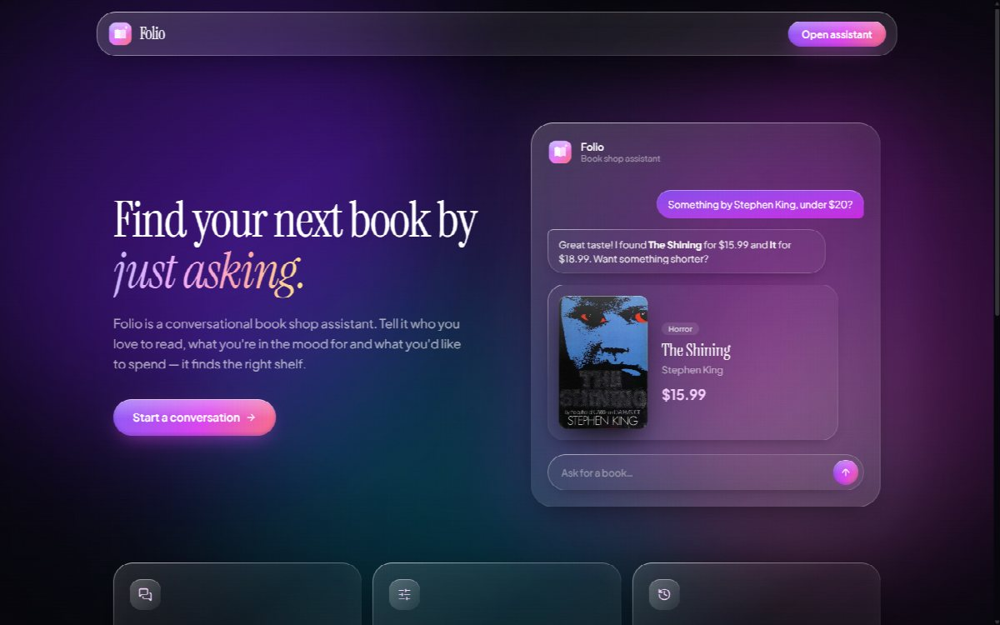
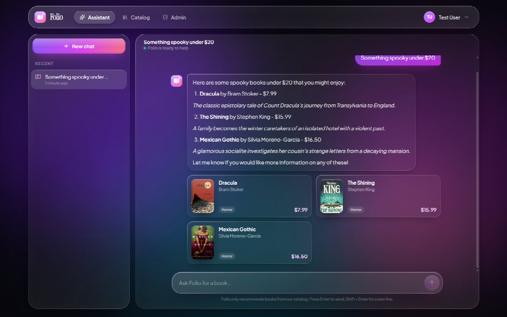
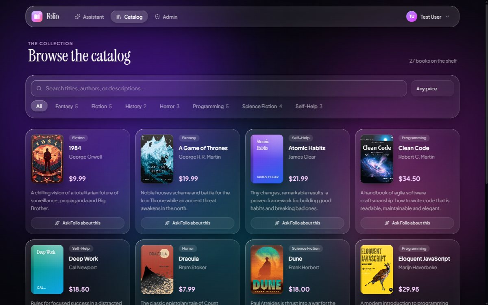
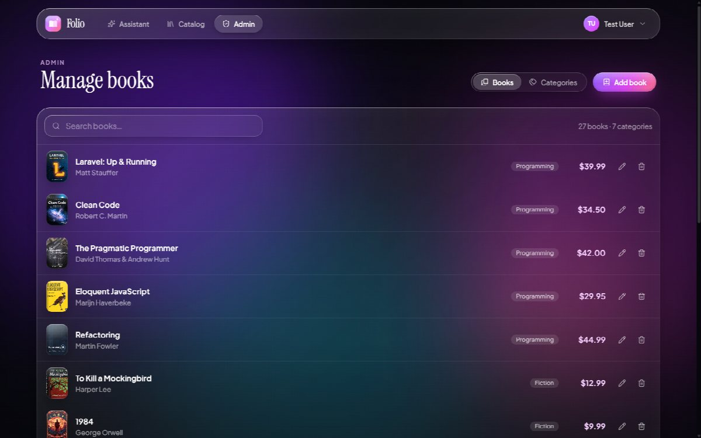
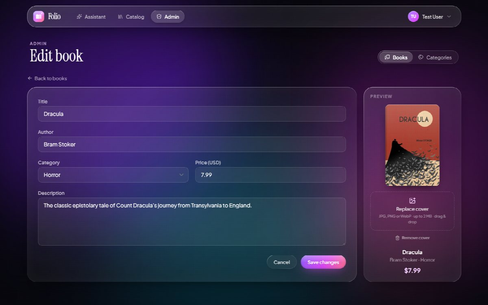
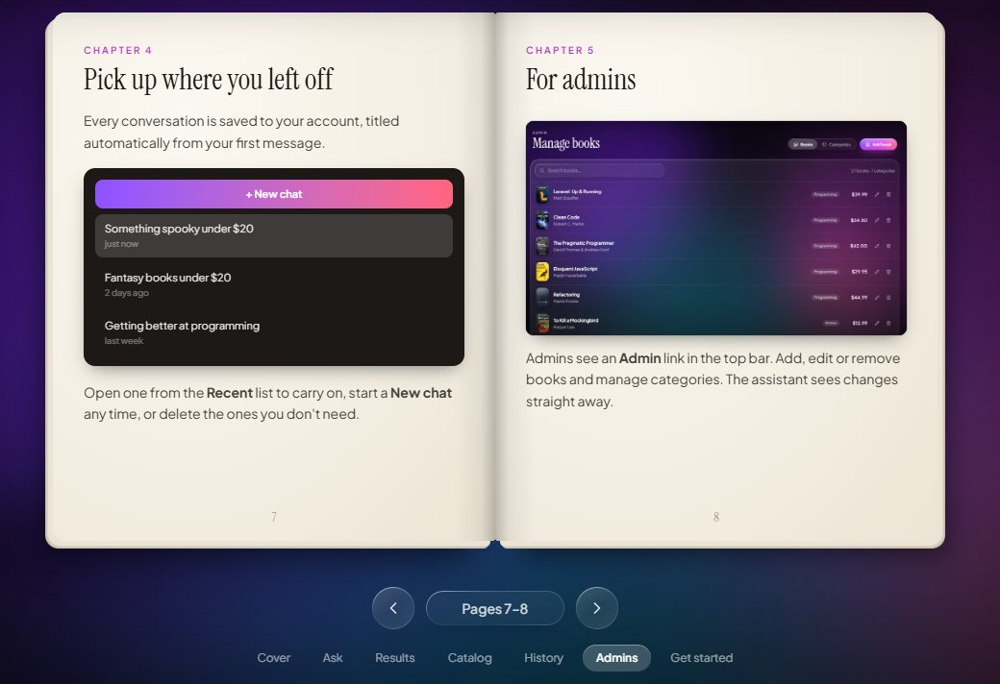
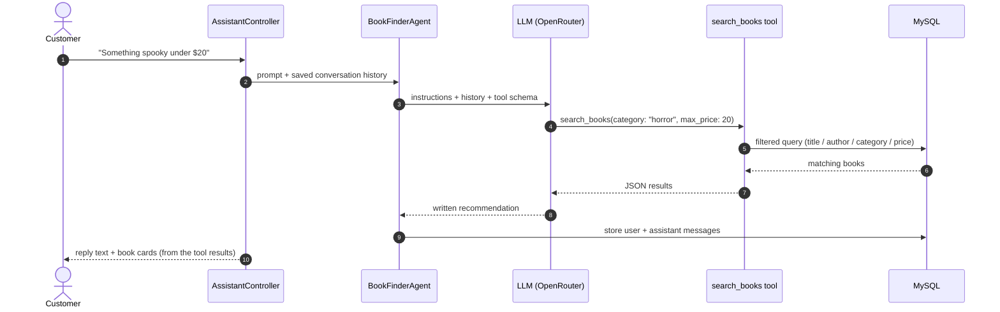

<div align="center">

# 📚 Folio

### Find your next book by just asking.

An AI-powered bookshop assistant built with Laravel, Inertia and React. Customers describe what they want in plain language, and Folio searches the real catalog and replies with recommendations and book cards.

[](https://laravel.com)
[](https://php.net)
[](https://react.dev)
[](https://inertiajs.com)
[](https://tailwindcss.com)
[](#-testing)
[](LICENSE)



</div>

---

## Table of Contents

- [Overview](#-overview)
- [Features](#-features)
- [Screenshots](#-screenshots)
- [How the AI Works](#-how-the-ai-works)
- [Tech Stack](#-tech-stack)
- [Getting Started](#-getting-started)
- [Configuration](#-configuration)
- [Usage](#-usage)
- [Project Structure](#-project-structure)
- [Routes](#-routes)
- [Testing](#-testing)
- [Deployment](#-deployment)
- [Troubleshooting](#-troubleshooting)
- [Credits](#-credits)
- [License](#-license)

---

## ✨ Overview

Filter-based shop searches make you think like a database. Folio lets customers shop the way they'd talk to a bookseller:

> **"Something spooky under $20"** → *Dracula ($7.99), The Shining ($15.99) and Mexican Gothic ($16.50)*, each shown as a card with its cover and price.

An LLM agent works out the author, category, keywords and budget from the message, then calls a database search tool. It **only recommends books that exist in the catalog**, and it remembers the conversation, so follow-ups like *"anything cheaper?"* just work.

The interface uses a dark **liquid glass** design: frosted, refractive panels over a moving aurora background.

---

## 🚀 Features

### For customers

| | |
|---|---|
| 💬 **Conversational search** | Ask in plain words. Folio maps topics to categories ("web development" → Programming) and understands budgets ("under $15"). |
| 🃏 **Book result cards** | Every reply shows the matching books with cover, category and price. |
| 🧠 **Conversation memory** | Each chat is saved and titled automatically. Reopen any chat from the sidebar and pick up where you left off. |
| 🔎 **Catalog browser** | Debounced search, category filters, a price filter, pagination, and an *Ask Folio about this* button on every book. |
| 📖 **Interactive 3D guide** | A page-turning flip book on the landing page explains the platform, with real screenshots. |
| 🛍️ **Live "On the shelf" carousel** | An auto-scrolling shelf of the newest books with covers. It refreshes every minute. |

### For admins

| | |
|---|---|
| 📚 **Book management** | Add, edit and delete books, with search and pagination. |
| 🖼️ **Cover uploads** | Drag and drop JPG, PNG or WebP covers, with a live preview and progress bar. Old files are cleaned up automatically. |
| 🏷️ **Category management** | Create categories, rename them inline, and delete them safely (a category that still has books can't be deleted). |
| 🔐 **Locked-down roles** | Admin rights can only be granted from the command line, never through a web form. |

### Under the hood

- **Responsive** from 390px phones to wide desktops. The flip book switches to one page at a time on mobile.
- **Accessible**: keyboard navigation, ARIA labels, focus states, and support for `prefers-reduced-motion`.
- **Resilient AI**: rate limiting, step limits, automatic repair of saved conversation history, and friendly fallbacks instead of blank replies (see [How the AI Works](#-how-the-ai-works)).
- **51 automated tests** covering chat, ownership checks, admin access, uploads and the landing page.

---

## 📸 Screenshots

<table>
  <tr>
    <td width="50%"><p align="center"><b>AI assistant</b>: natural-language search with book cards</p></td>
    <td width="50%"><p align="center"><b>Catalog</b>: search, category and price filters</p></td>
  </tr>
  <tr>
    <td width="50%"><p align="center"><b>Admin</b>: manage books and categories</p></td>
    <td width="50%"><p align="center"><b>Cover upload</b>: drag and drop with a live preview</p></td>
  </tr>
  <tr>
    <td colspan="2"><p align="center"><b>3D flip book guide</b>: click, swipe or use the arrow keys to turn pages</p></td>
  </tr>
</table>

---

## 🤖 How the AI Works



| Component | Responsibility |
|---|---|
| [`BookFinderAgent`](app/Ai/Agents/BookFinderAgent.php) | System prompt (topic → category mapping, catalog-only rule, staying on topic) and conversation memory via `RemembersConversations`. |
| [`SearchBooks`](app/Ai/Tools/SearchBooks.php) | The tool the model calls. Filters by keywords, author, category and price range, and returns up to 6 books as JSON. |
| [`AssistantController`](app/Http/Controllers/AssistantController.php) | Chat endpoints. Turns tool results into book cards and checks that each conversation belongs to the user making the request. |

### Reliability safeguards

| Safeguard | Why it exists |
|---|---|
| `#[MaxSteps(6)]` | The SDK's default is `round(tools × 1.5)`, which is only **2** steps for one tool. A retried search would end the turn before any reply was written. |
| History repair | A turn cut off at the step limit can save a tool call with no result. Providers reject that history, so unanswered calls are dropped before each request. |
| Empty-reply fallback | If the model ever returns no text, the user gets a helpful prompt instead of a blank bubble. |
| Rate limiting | `throttle:20,1` on the message endpoint protects your API budget. |
| Graceful errors | Provider failures are logged and return a friendly `503` with a *Try again* button. |

---

## 🛠 Tech Stack

| Layer | Technology |
|---|---|
| **Backend** | Laravel 13 · PHP 8.3+ |
| **AI** | [Laravel AI](https://github.com/laravel/ai) (agents, tools, conversation memory) · OpenRouter by default; any supported provider works |
| **Frontend** | Inertia.js 2 · React 18 · Ziggy |
| **Styling** | Tailwind CSS 4 (`@tailwindcss/vite`) · lucide-react icons · custom liquid-glass components |
| **Auth** | Laravel Breeze (login, registration, email verification, password reset) |
| **Database** | MySQL (SQLite works for tests) |
| **Build** | Vite 8 |

---

## 🏁 Getting Started

### Prerequisites

- **PHP 8.3+** with `pdo_mysql`, `gd` and `fileinfo`
- **Composer 2**
- **Node.js 20+** and npm
- **MySQL 8** (or MariaDB)
- An API key for an AI provider. [OpenRouter](https://openrouter.ai) is the default.

### Installation

```bash
# 1. Clone
git clone https://github.com/AhmedAlsirMubarak/Book-AiAssistance.git
cd Book-AiAssistance

# 2. Install dependencies
composer install
npm install

# 3. Environment
cp .env.example .env
php artisan key:generate
```

Edit `.env` with your database and AI credentials (see [Configuration](#-configuration)), then:

```bash
# 4. Database, demo data and the public storage link (needed for cover images)
php artisan migrate --seed
php artisan storage:link

# 5. Run it
composer dev
```

`composer dev` starts the web server, queue worker, log viewer and Vite together. Open **http://localhost:8000**.

> 💡 **Using Laragon?** Put the project in `C:\laragon\www`, run `npm run dev` (or `npm run build`) and open **http://book-aiassistant.test**.

---

## ⚙️ Configuration

| Variable | Default | Description |
|---|---|---|
| `AI_PROVIDER` | `openrouter` | Any provider defined in [`config/ai.php`](config/ai.php): `openai`, `anthropic`, `gemini`, `groq`, `mistral`, `ollama`, … |
| `AI_ASSISTANT_MODEL` | `openai/gpt-4o-mini` | The model name, in the format your provider expects. |
| `OPEN_ROUTER_API_KEY` | – | Required when using OpenRouter. |
| `OPENAI_API_KEY` | – | Required when using OpenAI directly. |
| `DB_*` | – | Your MySQL connection. |
| `APP_URL` | `http://localhost` | Your site's base URL. |

**Example: switch to OpenAI**

```env
AI_PROVIDER=openai
AI_ASSISTANT_MODEL=gpt-4o-mini
OPENAI_API_KEY=sk-...
```

---

## 📖 Usage

### Demo account

The seeder creates about 30 books in 7 categories, plus an **admin** account:

| Email | Password | Role |
|---|---|---|
| `test@example.com` | `password` | Admin |

> ⚠️ Change or remove this account before deploying anywhere public.

### Things to try

- *"Fantasy books under $20"*
- *"What do you have by Stephen King?"*
- *"I want to get better at programming"*, then follow up with *"anything cheaper?"*

### Managing admins

Admin rights can't be granted through registration or the profile form. Use Artisan:

```bash
php artisan app:make-admin someone@example.com            # grant
php artisan app:make-admin someone@example.com --revoke   # revoke
```

Admins see an **Admin** link in the top bar, which opens `/admin/books` and `/admin/categories`.

### Book covers

Upload covers from the book form in Admin (JPG, PNG or WebP, up to 2 MB, at least 100×150 px). Covers are stored in `storage/app/public/covers`. Books without a cover get a gradient cover generated from the title. **Only books with real covers appear in the landing-page shelf.**

---

## 🗂 Project Structure

```
app/
├── Ai/
│   ├── Agents/BookFinderAgent.php      # LLM agent: prompt, memory, history repair
│   └── Tools/SearchBooks.php           # Catalog search tool the model calls
├── Http/Controllers/
│   ├── AssistantController.php         # Chat page, messages, conversation deletion
│   ├── BookController.php              # Public catalog
│   └── Admin/                          # Book and category management, cover uploads
└── Models/                             # Book, Category, AgentConversation, …

resources/js/
├── Components/
│   ├── FlipBook/                       # 3D page-turning guide + its content
│   ├── ShelfCarousel.jsx               # Auto-scrolling "On the shelf" carousel
│   ├── BookCover.jsx                   # Real cover or generated gradient cover
│   └── Aurora.jsx                      # Animated background behind the glass
├── Pages/
│   ├── Welcome.jsx                     # Landing page
│   ├── Dashboard.jsx                   # AI assistant chat
│   ├── Books/Index.jsx                 # Catalog
│   └── Admin/                          # Admin screens
└── lib/format.js                       # Safe Markdown → HTML, prices, relative times

resources/css/app.css                   # Tailwind 4 theme + liquid-glass utilities
routes/console.php                      # app:make-admin command
tests/Feature/                          # Assistant, Admin, Welcome and auth tests
```

---

## 🧭 Routes

| Method | URI | Access | Description |
|---|---|---|---|
| `GET` | `/` | Public | Landing page |
| `GET` | `/dashboard/{conversation?}` | Verified user | Assistant chat (`?prompt=` pre-fills the input) |
| `POST` | `/assistant/messages` | Verified user | Send a message and get a JSON reply with book cards (20 per minute) |
| `DELETE` | `/assistant/conversations/{id}` | Owner | Delete a conversation |
| `GET` | `/books` | Verified user | Catalog (`q`, `category`, `max_price`) |
| `GET` | `/admin/books` | Admin | Manage books |
| `GET` | `/admin/categories` | Admin | Manage categories |

---

## 🧪 Testing

```bash
composer test
```

The suite has **51 tests**. It uses `BookFinderAgent::fake()`, so it **never calls a real AI provider** and costs nothing to run. Coverage includes:

- chat flow, conversation ownership and deletion
- admin authorization, and checks that users can't make themselves admin
- cover upload, replace and remove, plus file cleanup
- the landing-page shelf (newest first, covers only, partial reloads)
- the AI safeguards: step limit, empty-reply fallback and history repair

> The default `phpunit.xml` uses in-memory SQLite. If your PHP build lacks `pdo_sqlite`, point the tests at a MySQL database instead:
>
> ```bash
> DB_CONNECTION=mysql DB_DATABASE=ai_agent_test php artisan test
> ```

---

## 🚢 Deployment

```bash
composer install --no-dev --optimize-autoloader
npm ci && npm run build

php artisan migrate --force
php artisan storage:link

php artisan config:cache
php artisan route:cache
php artisan view:cache
```

**Checklist**

- [ ] `APP_ENV=production` and `APP_DEBUG=false`
- [ ] `APP_URL` set to your real domain
- [ ] AI provider key set, with a spending limit at the provider
- [ ] Demo account removed, and admins granted with `app:make-admin`
- [ ] A queue worker running (`php artisan queue:work`)
- [ ] `storage/` and `bootstrap/cache/` writable by the web server

---

## 🩺 Troubleshooting

| Symptom | Fix |
|---|---|
| **Blank white page** | A stale `public/hot` file is pointing at a Vite server that isn't running. Run `npm run dev`, or delete `public/hot` and run `npm run build`. |
| **Cover images return 404** | Run `php artisan storage:link`. |
| **"The assistant is unavailable right now"** | Check your provider key and model name in `.env`, then look in `storage/logs/laravel.log` for the provider's actual error. |
| **Tests fail with "could not find driver"** | Your PHP has no `pdo_sqlite`. Use the MySQL test command [above](#-testing). |
| **Changes to the UI don't appear** | Rebuild the assets with `npm run build`, or keep `npm run dev` running. |

---

## 🙏 Credits

- Built on [Laravel](https://laravel.com), [Laravel AI](https://github.com/laravel/ai), [Inertia.js](https://inertiajs.com), [React](https://react.dev) and [Tailwind CSS](https://tailwindcss.com).
- Icons by [Lucide](https://lucide.dev).
- The sample cover on the landing page comes from [Open Library](https://openlibrary.org). Book cover artwork belongs to its respective publishers.

---

## 📄 License

Released under the [MIT License](LICENSE).

<div align="center">

**Built by [Ahmed Alsir](https://github.com/AhmedAlsirMubarak)**

</div>
